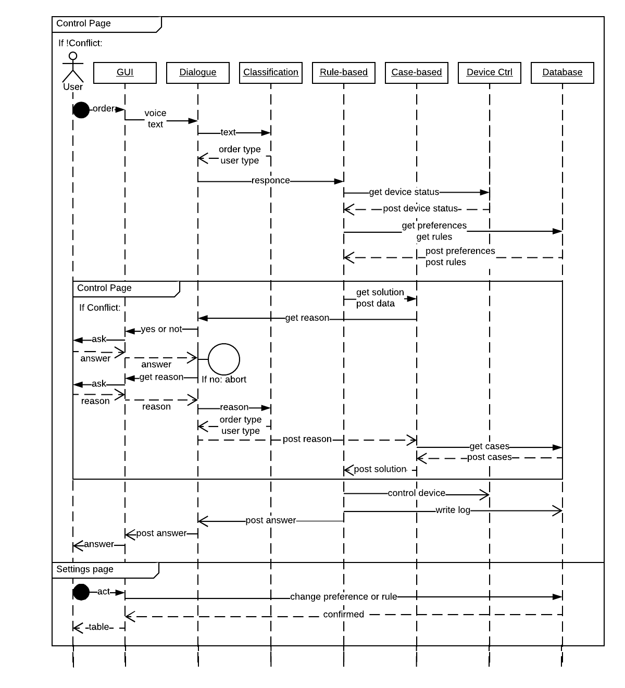

# Virtual Assistant

## Passport of the project

Virtual Assistant is the project of the Erasmus-Plus program students in the Middlesex University, London.
The main idea of the system is to control Smart-Home environment with dialogue based control interface.
The system is developed to to assists people with different preferences in their Activities of Dayly Life (ADL).
The system uses Graphical User Interface with text based dialogue
window; speech recognition and text to speech generating software (Google API). 
Virtual Assistant uses pre-defined preferences based on age of the user profile
with differentiated priorities of the needs including health, food, work, entertainment, security and
energy consumption of the devices. Virtual Assistant passed the validation tests done by
the developers and showed acceptable results in conflict resolution. The system uses Case-Based
Reasoning module to resolve conflicts, Feed-Forward Artificial Neural Networks to classify 
orders of the users and the reasons of the orders. Place of the research Sunny Hill House, Middlesex University, London.

## Research Question and Methodology

The aim of the research is to create a voice based dialogue manager for multi-users
with identical priority that allows controlling actuators inside the Sunny Hill House in
conflict situations. Conflict Resolution sub-system will communicate with different users
to collect the data about reasoning behind the actions they want to be done by the system.
For example, if two identical users want conflicted actions to be done they will
communicate with system to give reasons to act in the way they want. After that, the system
will make a decision based on the new information gained from users and will give
recommendations till the conflict will be eliminated. An example of that situation is
described in the scenario template in the end of the proposal.

## Architecture of the system


- GUI - web-pages
  - Login page - page where you choose user.
  - Control page - dialogue with system.
  - Preferences page - page to change the preferences of the users (no implementation yet)
  - Rules page - page of rules of the system (no implementation yet): forex, turn off kettle from 9.00 pm till 10.00 pm.
- Front end
  - Flask microwebframework for python 3 - controls GUI.
- Cloud API
  - Speech recognition - Google API to recognise voice input. [Google Cloud API](https://cloud.google.com/speech/)
  - Speech generation - Google HTML5 API TtS. [Google Voice Generator](https://developers.google.com/web/updates/2014/01/Web-apps-that-talk-Introduction-to-the-Speech-Synthesis-API)
- Core System
  - Dialogue Manager - module to communicate with the user; send data to the other modules;
  - Order Classification - Feed-Forward Artificial Neural Network: Perceptron with one hidden 10 neurons
layer, back-propagation optimisation method (gradient descent parameter = 1), that classifies orders into
4 groups (on and off state of two devices).
  - Reason Classification - Feed-Forward Artificial Neural Network: Perceptron with one hidden 10 neurons
layer, back-propagation optimisation method (gradient descent parameter = 1), that classifies reasons into
health, food, work, entertainment, security and energy consumption of the devices.
  - Rule-Based Reasoner - module that checks rules of the system and states of the devices
to control system if there is no conflict between user order and system state.
  - Case-Based Reasoner - module that controls the system if there is a conflict between
user input and system state or other user input.
  - Device Control Unit - module that controls and monitors state of the devices (in this particular case: Kettle and Lamp)
- Databases
  - MySQL database - as a database was used MySQL.
- Devices
  - Kettle and Lamp controlled by [VeraSecure](http://getvera.com/)

## User cases



## Getting Started

These instructions will get you a copy of the project up and running on your local machine for development and testing purposes. See deployment for notes on how to deploy the project on a live system.

### Prerequisites

What things you need to install the software and how to install them

```
Give examples
```

### Installing

A step by step series of examples that tell you have to get a development env running

Say what the step will be

```
Give the example
```

And repeat

```
until finished
```

End with an example of getting some data out of the system or using it for a little demo

## Running the tests

Explain how to run the automated tests for this system

### Break down into end to end tests

Explain what these tests test and why

```
Give an example
```

### And coding style tests

Explain what these tests test and why

```
Give an example
```

## Deployment

Add additional notes about how to deploy this on a live system

## Built With

* [Flask web framework](https://www.jetbrains.com/pycharm/)
* [Lucid chart diagram online editor](https://www.lucidchart.com)
* [Pycharm IDE](https://www.jetbrains.com/pycharm/)
* [Una animated emojies](https://github.com/una/animated-emojis)
* [W3School CSS templates](https://www.w3schools.com/w3css/w3css_templates.asp)

## Authors

* **Bauyrzhan Ospan**
* **Mario Jose Quinde Li Say Tan**

See also the list of [contributors](https://github.com/your/project/contributors) who participated in this project.

## License

This project is licensed under the MIT License - see the [LICENSE.md](LICENSE.md) file for details

## Acknowledgments

* Diseases and condition list is from https://www.cdc.gov/diseasesconditions/index.html
* Perceptron made on work of http://www.tarnlab.com/text-classification-using-neural-networks/

## Bibliography

* [Improved Multi-user Interaction in
a Smart Environment Through a Preference-Based Conflict Resolution Virtual Assistant](http://ieeexplore.ieee.org/document/8114654/)
* [A Sensitivity Analysis of (and Practitioners' Guide to) Convolutional Neural Networks for Sentence Classification](https://arxiv.org/abs/1510.03820)
* [Using argumentation to manage users’ preferences](https://www.sciencedirect.com/science/article/pii/S0167739X1630379X)
* [Is Context-aware Reasoning = Case-based Reasoning?](http://eprints.mdx.ac.uk/21527/)
* [A survey on managing users’ preferences in ambient intelligence](https://link.springer.com/article/10.1007/s10209-017-0527-y)
* [Learning frequent behaviours of the users in 
Intelligent Environments](http://ieeexplore.ieee.org/document/6516530/)
* [Distance Metric Learning for Large Margin Nearest Neighbor Classification](http://www.jmlr.org/papers/v10/weinberger09a.html)
* [Convolutional Neural Networks for Sentence Classification](https://arxiv.org/abs/1408.5882)
* [An Agent-Based Architecture for Sensor Data Collection and Reasoning in Smart Home Environments for Independent Living](https://dl.acm.org/citation.cfm?id=2966058)
* [Design and evaluation of a smart home voice interface for the elderly: acceptability and objection aspects](https://link.springer.com/article/10.1007/s00779-011-0470-5)
* [Configuration of smart environments made simple: Combining visual modeling with semantic metadata and reasoning](http://ieeexplore.ieee.org/document/7030116/)
* [Towards adaptive control in smart homes: Overall system design and initial evaluation of activity recognition](https://dspace.lboro.ac.uk/dspace-jspui/handle/2134/24473)
* [Machine Learning Based Adaptive Context-Aware System for Smart Home Environment](https://pdfs.semanticscholar.org/8cf5/fe5062727744f5429bb34d9c0bd24f439ee6.pdf)
* [An Ontology-based Context-aware System for Smart Homes: E-care@home](https://www.ncbi.nlm.nih.gov/pubmed/28684686)
* [Policy Conflict Resolution in IoT via Planning](https://link.springer.com/chapter/10.1007/978-3-319-57351-9_22)
* [Context-based conflict management in pervasive platforms](http://ieeexplore.ieee.org/document/7917567/)
* [SVM-Based Multimodal Classification of Activities of Daily Living in Health Smart Homes: Sensors, Algorithms, and First Experimental Results](http://ieeexplore.ieee.org/abstract/document/5352277/)
* [Context-Aware User Modeling and Semantic Interoperability in Smart Home Environments](http://ieeexplore.ieee.org/document/6735563/)

